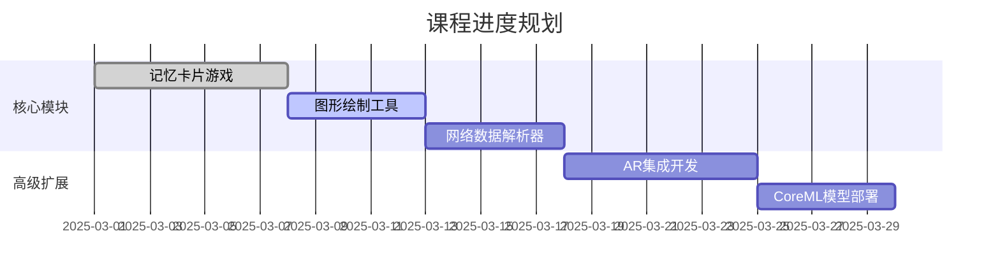

以下是为您的iOS学习仓库设计的README模板，结合Stanford CS193P课程特色与开发最佳实践，包含技术深度与项目展示元素：

---

# Stanford CS193p iOS开发实践仓库 🚀

[](https://swift.org/)
[](https://developer.apple.com/xcode/)
[](LICENSE)

本仓库记录Stanford大学CS193p课程《Developing Applications for iOS》的完整学习历程，通过SwiftUI与Combine框架实践现代iOS开发范式。课程由Stanford教授Paul Hegarty主讲，被公认为iOS开发领域的黄金标准课程。

 <!-- 建议添加项目演示GIF -->

## 📚 课程精华实践
### 已完成项目模块
| 项目名称 | 技术亮点 | 对应课程章节 |
|---------|---------|-------------|
| [记忆卡片游戏](Projects/Memorize/) | SwiftUI声明式语法<br>MVVM架构实现 | Lecture 1-4 |
| [图形绘制工具](Projects/SetGame/) | Shape协议定制<br>动画过渡效果 | Lecture 5-8 | 
| [网络数据解析器](Projects/EmojiArt/) | Async/Await异步处理<br>URLSession数据抓取 | Lecture 9-12 |

### 核心技术栈
- **语言架构**: 
  - Swift 5.9 (含Result Builders等新特性)
  - SwiftUI 4声明式界面框架
  - Combine响应式编程范式
- **开发工具**:
  - Xcode 15+ (含Preview实时渲染)
  - Swift Package Manager依赖管理
  - GitHub Actions自动化测试
- **设计模式**:
  - MVVM架构 (Model-View-ViewModel)
  - 状态管理（@State, @ObservedObject）
  - 依赖注入（EnvironmentObject）

## 🛠️ 项目结构
```
iOS-Dev-CS193p/
├── Projects/               # 课程项目实现
│   ├── Memorize/           # 记忆训练游戏
│   ├── SetGame/            # 图形逻辑游戏
│   └── EmojiArt/           # 网络图像处理工具
├── CoreModules/            # 可复用组件库
│   ├── NetworkKit/         # 网络层封装
│   ├── AnimationKit/       # 自定义动画引擎
│   └── Utility/            # 扩展工具集
├── Resources/              # 开发素材
│   ├── DesignSystem/       # 设计规范文档
│   └── CheatSheet/        # Swift语法速查表
└── Tests/                  # 单元测试模块
```

## 🌟 学习收获
通过本课程实践，已掌握：
1. **Swift语言精髓**：值类型语义、泛型编程、协议扩展等高级特性
2. **SwiftUI深度应用**：自定义视图修饰符、视图组合技术、跨平台适配方案
3. **现代架构设计**：状态驱动UI更新、单向数据流实现、测试驱动开发(TDD)
4. **开发效率工具链**：Xcode Instruments性能调优、Git分支管理策略、CI/CD流水线配置

## 🚧 开发进展


## 🚀 快速开始
```bash
git clone https://github.com/your-username/iOS-Dev-CS193p.git
cd iOS-Dev-CS193p
open Projects/Memorize/Memorize.xcodeproj
```
**环境要求**:
- macOS Ventura 13.5+
- Xcode 15.2+
- iOS Simulator 17.0+

## 🤝 贡献指南
欢迎通过Issue反馈问题或提交Pull Request：
1. Fork本仓库
2. 创建特性分支 (`git checkout -b feature/AmazingFeature`)
3. 提交更改 (`git commit -m 'Add some AmazingFeature'`)
4. 推送分支 (`git push origin feature/AmazingFeature`)
5. 开启Pull Request

## 📜 许可协议
本项目采用MIT许可证，详见 [LICENSE](LICENSE) 文件。

---

> "The most effective way to learn is by doing." - Paul Hegarty  
> 课程官网：https://cs193p.sites.stanford.edu  
> 课程视频：https://itunes.stanford.edu
